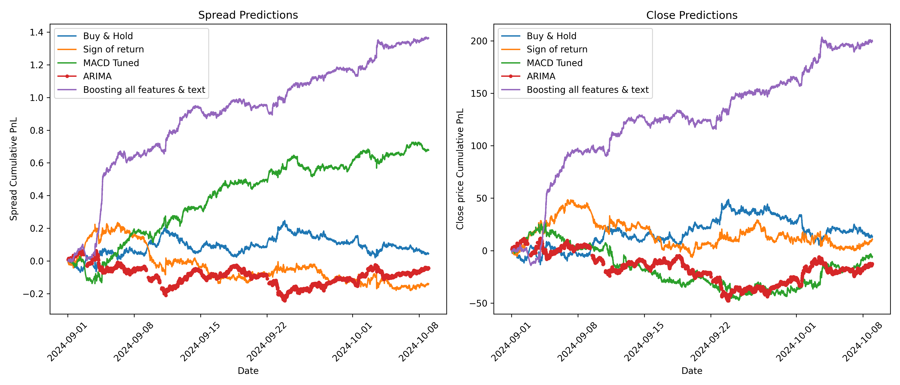

# Test task

Basically you can track the of the task chronology from the notebooks, but I have short log what I have been doing & when so you can probably better understand how I was using time given to me

## Task formulation

For this task I focused on predicting both spread & close prices
Since the data is from the period of 01-01-2023 - 08-10-2024, I decided to leave last month with a bit for final testing. Also I made sure, that during training the final model, I will take 2 month gap so there will be no data leakage (from calculating running statistics and etc)

During this project I have implemented

* Baseline strategies like Buy & Hold, Sign of Return & some MACD
* ARIMA on target column only with downsampled till 15 mins (tested more freq., worked worse)
* XGBoost model with simple textual features (sentiment polarity signal from vaderSentiment) & some lagged features 

### Results

Predictions are done on testing period from 01-09-2024 till 08-10-2024, ARIMA results from 15-mins windows

----
Unfortunately I could not allocate 100% of time I had, due to health & personal issues, but it is what it is. here are some logs of my work

### Wed 29.01.2025

* Did EDA & baselines (notebooks 1 & 2)

### Sunday 02.01.2025

* Did Arima & boosting with simple text

What wanted I originally wanted to try also
* A LOT More EDA & feature engineering (adding MACD-like signals and etc.)
* Try facebook prophet
* More time on text (I have not really checked the performance out-of-the-box of vaderSentiment, but manual 100-example observing seemed fine for me). Ideally I would love to fine-tune my own BERT using high deltas of target feature on text as labelling
* Explore possibilities of LSTM's/transformers (might not be good in prod lol) & RL

